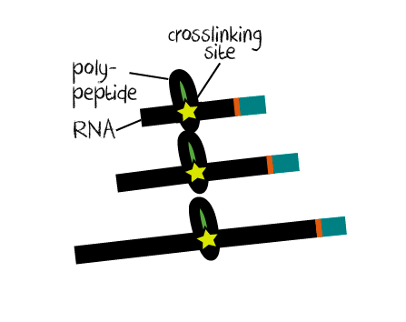

```{r setup, echo=FALSE, results="hide"}
knitr::opts_chunk$set(tidy    = FALSE,
                      cache   = FALSE,
                      dev     = "png",
                      message = FALSE,
                      error   = FALSE,
                      warning = TRUE)
```	

# Preface 


```{r, eval = FALSE, echo = FALSE}
#**Note:** if you use DEWSeq in published research, please cite:
#
#> Authors. (Year)
#> Moderated estimation of fold change and dispersion for RNA-seq data with DESeq2.
#> *Genome Biology*, **15**:550.
#> [10.1186/s13059-014-0550-8](http://dx.doi.org/10.1186/s13059-014-0550-8)
```

## Related packages 

Other Bioconductor package with similar aim:

* `r Biocpkg("csaw")`

Please get familiar with this Bioconductor package before you are using DEWSeq

* `r Biocpkg("DESeq2")`
* `r Biocpkg("IHW")`

## Acknowledgements

Wolfgang Huber and Matthias Hentze for mentoring, advice and discussion. Benjamin Lang and Gian Tartaglia for great help with functional analysis and benchmarking,
as well as feedback to the vignette. Mike Love, Simon Anders, Bernd Klaus and Frederick Ziebell for comments and discussion.

# Introduction 

## Introduction to eCLIP sequencing 

RNA-binding proteins (RBPs) play a key role in the life-time 
of RNAs. They are involved in RNA synthesis, stability, 
degradation, transport and translation and play an 
important layer of regulation in the cell. Over 1900 mouse 
and over 1400 human RBPs were detected in different high-throughput 
detection studies, a lot of them without known RNA-binding
function [@Hentze2018].

It is of great interest to detect binding sites of RBPs to 
study underlying mechanisms of their RNA binding. Individual 
nucleotide resolution crosslinking and immunoprecipitation (iCLIP) 
[@Konig2010] and 
the derived protocol enhanced CLIP (eCLIP) [@VanNostrand2016]
sequencing protocols rely on UV crosslinking inducing covalent
bonds of RNA and proteins in close proximity. When reverse
transcribing the RNA fragment bound to the protein, a majority
of the time the reverse transcriptase will fall of at the
crosslink site. Althrough
eCLIP introduces updates in chemistry, the use of a size-matched 
input (SMI) control sample is an essential addition to the protocol
which can be also adapted to iCLIP or similar protocols.

```{r, fig.cap = "Crosslink site trunction at reverse transcription", echo =FALSE}
knitr::include_graphics("truncation.png")
```


In iCLIP and eCLIP, truncation events are extracted as one nucleotide position
next to the cDNA fragment (aligned read). In the classical protocols real 
truncations cannot be distinguished from read-through reads or other 
reads coming for otherwise truncated reads, like it can happen at 
RNA modification sites or at crosslinking sites from other proteins.
This this might be individual for many proteins (and the
remaining polypoptide of the digested protein). Other protocols like HITS-CLIP
and PAR-CLIP [@Hafner2010] rely exclusively on read-through events only 
(although using other reverse transcriptases). Hybrid approaches do exist but
the technical difficulty of said protocols and many optimizations steps makes 
them rather hard to combine.

```{r, fig.cap = "Truncation sites (often referred to as crosslink sites) are the neighboring position of the aligned read.", fig.small = TRUE, echo = FALSE} 
# fig.width=200, out.width="200px"

```

In summary, iCLIP and eCLIP protocols provide count data for single-nucleotide
positions which are subjected to many heuristic events which are described 
in the next chapter.


We will need required packages for the rest of this vignette

```{r libs, message=FALSE}
library("IHW")
library("tidyverse")
```


## The idea behind DEWSeq 

### Understanding the signal

#### Binding modes

Unlike transcription factors, RNA-binding proteins have many different binding
modes [@Hentze2018], some bind sequence specific, some have preference for 
structures (like stem-loops), some like to bind RNA modifications,
others are mostly found at UTRs etc. and most of them do not have
a known RNA-binding domain and bind using disordered regions with unknown 
target preferences. 

```{r, fig.cap = "Different binding modes of RNA-binding proteins", fig.wide = TRUE, echo = FALSE} 
# fig.width=200, out.width="200px"
knitr::include_graphics("binding_modes.png")
```
All these different binding modes can result in different crosslinking patterns,
hence different truncation event patterns.

#### Chance of crosslinking

UV crosslinking at 254 nm is used to induce covalent (very strong) chemical
bonds within very close proximity of RNAs to proteins. This allows a "snapshot"
of the RNA binding and ensures no disassociation of the RNA-protein complexes
in further steps. This process is very unfortunately rather inefficient. 
Typically, crosslinking with Stratlinker(R) UV crosslinkers do have an
effecticity of ~1-3% or less (depending on UV lamp intensity and time of 
irradiation). Newer crosslinkers with lasers can go up to ~10-20% crosslinking
efficiency depending on protein and setup. 

```{r, fig.cap = "Chance of crosslinking", fig.small = TRUE, echo = FALSE} 
# fig.width=200, out.width="200px"

```

Depending on the type of protein and the binding mode, this can result in 
different crosslinking pattern for each protein. Crosslinking will also 
affect other proteins, and the IP step will only enrich for RNA fragments
bound to the RNA and crosslinked samples show a certain background 
different to normal expression patterns measured by RNA-sequencing.

#### Background and antibodies

##### Enrichment of targets

Immunoprecipitating your (crosslinked) protein and performing sequencing 
without any RNA digestion is called RIP-seq (without crosslinking) or 
HITS-CLIP (with crosslinking). These studies nicely show that the
enrichment of your protein with antibodies recognizing protein tags or
native epitops will also enrich RNA fragments bound to the protein.
However it is clear that the IPed samples contain almost a full transcriptomic 
(random) background. Depending on the specificity of your antibody, 
your purification method (e.g. type of beads) and many other factors, 
this can vary for different proteins. The authors do not know any cases 
where IP steps exclusively purify targets, if you find any cases, please
contact the authors, we would really like to know.

##### Contaminants vs background  

If you take a close look to the first iCLIP analysis protocols 
(and lot of protocols to date), you will notice that snoRNAs, lincRNAs
and other short RNAs are excluded from the protocol althought they 
make up a majority of the signal. They were either treated as contaminants
and dismissed right away, or more recently it was recommended to intersect the 
data with an orthogonal data like RNA-seq knockouts and only look at the
regions of interest. As already mentioned, it was shown that size-matched
input (SMI) controls can control for different artifacts from crosslinking 
and library preparation [@VanNostrand2016] and after correction it is 
possible to detected real lincRNC, snoRNA etc binders. 

Crosslinked samples do have a different backgroud compared to expression
levels (as detected with RNA-seq). Therefore it is of great importance 
to compare the IPed sample to a proper input control. *SMI controls
can be easily applied for any CLIP protocols*.  

#### RNA fragment length and RNase concentrations

To narrow down the target RNAs to the binding site region, RNase is used
to digest RNA not protected by your protein. Using different RNase
concentration will result in different RNA fragment lengths.
Also, if your protein is stacked tighly together protecting a 
larger area from digestion, this can result in longer RNA fragments 
which can affect the crosslinking pattern [@Haberman2017]. 

```{r, fig.cap = "Different RNase concentrations will result in different fragment sizes.", fig.small=TRUE, echo = FALSE} 

```

#### Read-throughs

iCLIP and eCLIP depend on the truncation of the reverse transcriptase
at crosslink sites. In contrast, HITS-CLIP and PAR-CLIP need reverse
transcriptases reading through the crosslink sites. 
Both methods use different reverse transcriptases with 
different likelihood of truncating or reading through. 
The chance of this event will also be affected by the
polypeptide which is left after protein digestion of the protein of interest.

```{r, fig.cap = "Read-throughs", fig.small = T, echo = FALSE} 

```

"Read-throughs" can truncate at a crosslink site from the same proteins,
a different protein, a RNA modifications, any other unknown events or
finish at the end of an RNA fragment. Due to the low efficency 
the crosslinking of multiple proteins is usually less likely, however 
not no improbable.

##### Early truncations 

Early truncations can also appear on a long RNA fragment with multiple 
crosslink sites from different proteins or multiple crosslink sites 
from the same protein. Again, although low crosslinking
efficency reduces the chance of having multiple crosslink sites
at once, those events occur stochastically. 

```{r early truncation, fig.cap = "Early truncations.", echo = FALSE} 

```


### Method

#### Differentially expressed sliding windows 

Because of the properties of eCLIP or iCLIP data described above, we use a sliding
window approach (where different window and step sizes can be chosen in the 
preprocessing) and test for significant enrichment in the IP over the control.
For this, we extended `r Biocpkg("DESeq2")` for a one-sided wald test to filter windows with negative wald stat values and do a right-tailed test on the remaining windows. The filtering step increases the performance when testing millions of windows. 

```{r deseq overview image, fig.cap = "Sliding window approach with single-nucleotide position count data", echo = FALSE} 

```

#### Combining significant windows

Contrary to large fragments detected in ChIP-seq, the truncation sites 
are only one nucleotide. To combine windows, `r Biocpkg("csaw")` 
defines ChIP-seq binding regions which are then subjected to multiple
hypothesis correction.


  ##TODO##
In ChIP-seq cDNA fragments share coverage from same 
and therefore
implements the SIMES method to join coverage blocks and treats them
as one entity for multiple hypothesis correction. Since the single-nucleotide
do not have the same property as cDNA fragments and each gene in eCLIP/iCLIP
data has transcriptomic background with often large coverage blocks, in
DEWSeq we correct the p-value for each window with Bonferroni with the number
of overlaps. 


```{r, fig.cap = "Sliding window approach with single-nucleotide position count data", echo = FALSE, fig.small = TRUE} 
# fig.width=200, out.width="200px"

```

Then we apply multiple hypothesis correction.

## Prerequisits for DEWSeq

Most importantly, replicates and input controls are required for the 
significance testing for DEWSeq. Currently, we only allow the use of 
`r Biocpkg("DESeq2")`'s wald test, not the LRT test for complexer models.
This will implemented later. If you want to use complexer models, you
might want to contact the authors.

### True input controls

Typically, CLIP-seq samples do have a lot of background which comes from
a mix of various transcripts with different expression levels.
Additionally, UV crosslinking does not  affect RNAs in a linear fashion, 
therefore an appropriate input control is needed for the analysis of
eCLIP/iCLIP data. Unfortunately, total RNA-seq does not reflect the 
UV crosslinked background, also IgG-, empty beads, or similar controls are 
not appropriate input controls. We recommend size-matched input controls
(SMI) controls as performed in the eCLIP protocol [@VanNostrand2016]. 
This type of input control is not protocol specific, therefore can be 
easily adapted to iCLIP or other CLIP studies. Most importantly, it can
control for truncations caused by interferences.

We recommend to use IgG or empty beads controls to flag (expression 
dependent) regions for optional removal. 

### Replicates

Biological replicates in high-throughput studies are needed in the 
significance testing process to ensure reproducibility of the results.
Please refer to the `r Biocpkg("csaw")` package for discussion on this topic.

In general, we recommend to ask yourself how many replicates would you
use when performing RNA-seq. Usually, the answer is, at least three
for the sample and three for the control (depending on many experimental
factors which also will apply for your CLIP study). As a tumb of rule, 
your number of replicates ideally should not be less if you are 
interested in an transcriptome wide analysis of your RNA-binding protein.

# Data preprocessing

DEWSeq needs a countmatrix and preprocessed annotation. The
preprocessing is done in two general steps.

1. Raw data preprocessing, alignment and PCR duplication removal
2. Extraction of crosslink sites, preprocessing of annotation and counting.

## Raw data preprocessing: From fastq to bam files

eCLIP or iCLIP data preprocessing can be extensive and time-consuming. 
Generally the steps for preprocessing are:

* Unique Molecular Identifiers (UMIs) extraction and demultiplexing
  ([Je Suite](https://gbcs.embl.de/portal/tiki-index.php?page=Je), or other
  tools). Usually the UMI is extracted from the fasta sequence and put into
  the header. Different tools put it at different locations (beginning or
  end of fastq header).
* Read quality filtering (optional)
* Trimming of sequencing adapters (with tools like
  [cutadapt](https://cutadapt.readthedocs.io))
* Second trimming step (extremely important for paired-end (standard) eCLIP
  libraries). This is needed because a 'bug' in the standard paired-end eCLIP
  protocol. Hint: Single-read seCLIP [@VanNostrand2017] has a lot of advantages to standard,
  paired-end eCLIP, one of them is that you can skip this preprocessing step.
* Quality Control ([fastqc](https://github.com/s-andrews/FastQC) with [multiqc](https://multiqc.info/) summary statistics or similar).
* Alignment ([Novoalign](http://www.novocraft.com/products/novoalign/), [STAR](https://github.com/alexdobin/STAR), or other (splice-aware) aligners, depending
  on your organisms)
* PCR duplication removal also called UMI evaluation
  [Je Suite](https://gbcs.embl.de/portal/tiki-index.php?page=Je) or 
  custom tools depending on your protocol and single-read or paired-end setup.
  Please use tools which consider sequencing errors in the UMI and read 
  sequences.
* Sort and index bam files (samtools or similar)

Eventually, you will end up with sorted *.bam* files.

## Crosslink site extraction and counting: From bam and gff3 files to count matrix and annotation

htseq-clip is the preprocessing pipeline developed for the use for
DEWSeq, but other tools may be used. htseq-clip does

* extract sites (typically crosslink sites) 
* flatten the annotation and create an annotation mapping file
* generate sliding windows from the flattened annotation 
* count sites for the sliding windows
* create count matrices 

in addition it will

* split the annotation into UTRs, CDS
* count non-overlapping regions (UTRs, CDS, exons, introns, etc) for 
   enrichment plots or DESeq2 analysis
* calculating the site distance to exon/intron junctions

htseq-clip is provided as a singularity
container and comes with a Snakemake workflow for processing on local computers,
servers, or computer clusters.

All you need is

 * .bam files (PCR duplication removed, sorted)
 * .bam.bai index files 
 * .gff3 files (Preferrably from Gencode or similar)

Please find all information, the documentation and downloads can be found here:
http://www.hentze.embl.de/public/htseq-clip/

Tip: You can use Sailfish, Kallisto, RSEM, Salmon or any (pseudo)aligner to 
get an estimation of the different expression levels of transcripts. Use this to 
filter the annotation before flattening it. 

```{r, echo = FALSE, eval = FALSE}
# Analysis strategies for CLIP data
```

# Detection of enriched regions with DEWSeq
 
DEWSeq uses a sliding window approach with DESeq2 for enriched binding sites. 

## Load the library

First step is to load the library with this command

```{r load library, eval = TRUE}
require(DEWSeq)
```

## Importing data for DEWSeq

### Load test data

Use this command to load the ENCODE SLBP data set.

```{r load test data, eval = TRUE}
data(SLBP_K562_w50s20)
```

This data contains two IP and one input control (SMI) samples which
is not ideal, however it is small enough as test data. 

```{r head of test data, eval = TRUE}
ddw <- SLBP_K562_w50s20
ddw
```

### From count matrix  

We need to read in the 

* count matrix and the (UNIQUE_ID, counts per sample)
* annotation file (UNIQUE_ID, chromosome locations, other info)

which can be prepared with htseq-clip (see above)

For this, we recommend data.table or tidyr packages to read in the data swiftly.
To data data.table is significantly faster than tidyr.

```{r loading tidyverse, eval = TRUE}
library(tidyverse)
library(data.table)
```

First we read in counts 

```{r read in count matrix, eval = FALSE}
countData <- fread("path/swcounts/count_matrix.txt.gz", sep = "\t")

# or alternatively with tidyr:
# countData <- read_tsv("path/swcounts/count_matrix.txt.gz")
```

Then we read in the annotation data frame 

```{r read in annotation, eval = FALSE}
annotationData <- fread("path/annotation/annotation.txt.gz", sep = "\t")

#or alternatively with tidyr:
#annotationData <- read_tsv("path/annotation/annotation.txt.gz")
```

Finally we have to create a sample description
```{r create colData, eval = FALSE}
colData <- data.frame(
  row.names = colnames(countData), 
  type      = factor(
                c(rep("IP", 3),    ##  change this accordingly
                  rep("SMI", 3)),  ##
                levels = c("IP", "SMI"))
)
```

This function will parse the annotation file and create a DESeq object

```{r example import, eval = FALSE}
ddw <- DESeqDataSetFromSlidingWindows(countData  = countData,
                                      colData    = colData,
                                      annotation = annotationData,
                                      tidy       = TRUE,
                                      design     = ~type)
```

This will return a DESeq object with the coordinates and annotation stores as 
rowAnnotation.

## Prefiltering

Prefiltering becomes even more important with large numbers of sliding windows. 
Please find more details here:
[http://bioconductor.org/packages/devel/bioc/vignettes/DESeq2/inst/doc/DESeq2.html#pre-filtering](DESeq2 vignette on pre-filtering)

```{r row filtering, eval = TRUE}
keep <- rowSums(counts(ddw)) >= 10
ddw <- ddw[keep,]
```

## Estimating Size Factors

The standard procedure to estimate size factors is 

```{r estimate size factors, eval = FALSE}
ddw <- estimateSizeFactors(ddw)
```


### Estimate size factors based on a specific set of RNAs

CLIP data often shows high expression of RNA contaminations, therefore you might 
want to normalise based on protein coding genes only

```{r filter for mRNAs, eval = TRUE}
ddw_mRNAs <- ddw[ rowData(ddw)[,"gene_type"] == "protein_coding", ]
ddw <- estimateSizeFactors(ddw_mRNAs)
rm(ddw_mRNAs)
```

## Differential expressed windows analysis

Estimate the dispersions and perform the wald test with these two functions.
Please note, currently, DEWSeq does not support LRT tests.

```{r estimate dispersions and wald test, eval = TRUE}
ddw <- estimateDispersions(ddw)
ddw <- nbinomWaldTest(ddw)
```

This performes a one-sided signficance test, looking for enrichment in the
IP samples vs the SMI controls. Also it will perform a correction
for p-values of overlapping windows: The function will determine how many 
overlapping windows for each window there are (this can vary at the end of 
features, e.g. a gene) and then perform Bonferroni for each window. 

These family-wise corrected windows will corrected for multiple testing 
with Benjamini-Hochberg.

```{r DEWSeq results, eval = TRUE}
resultWindows <- resultsDEWSeq(ddw,
                              contrast = c("type", "IP", "SMI"),
                              tidy = TRUE) %>% as_tibble

resultWindows
```

You might be interested to correct for multiple hypothesis testing with IHW.

```{r IHW multiple hypothesis correction, eval = TRUE, warning = FALSE}
resultWindows[,"p_adj_IHW"] <- adj_pvalues(ihw(pBonferroni ~ baseMean, 
                     data = resultWindows,
                     alpha = 0.05,
                     nfolds = 10))
```


Here some basic stats about the differentially expressed windows:

```{r windows tables, eval = TRUE}
resultWindows <- resultWindows %>% mutate(significant = resultWindows$p_adj_IHW < 0.05)

sum(resultWindows$significant)
```
`r sum(resultWindows$significant)` windows are significant. Here are the top 20 from `r resultWindows %>% filter(significant)  %>% .[["gene_name"]] %>% unique %>% length` genes:

```{r how genes form windows}
resultWindows %>% filter(significant) %>% arrange(desc(log2FoldChange))  %>% .[["gene_name"]] %>% unique %>% head(20)
```

SLBP is an histone-RNA binding protein, so we are quite happy to see that the
majority of the hits are coming from histone genes. 

## Combining regions

`resultWindows` contains information about the differential expression of
windows. Now we would like to combine overlapping windows to a binding region.


```{r extractRegions, eval = TRUE, results = "hide"}
resultRegions <- extractRegions(windowRes  = resultWindows,
                                padjCol    = "p_adj_IHW",
                                padjThresh = 0.05, 
                                log2FoldChangeThresh = 0.5) %>% as_tibble
```

Since we already corrected for the family wise error, we use the
`extractRegions` function to combine the overlapping significant windows and
provide metrics for best and worst p-adjusted value, as well as best and 
worst log2 fold change.

```{r resultRegions output, eval = TRUE}
resultRegions
```

`r nrow(resultRegions)` binding regions were found which can exported as
BED file so you can browse the regions in your genome browser of choice
or use it for further analyses.

```{r toBED output, eval = FALSE}
toBED(windowRes = resultWindows,
      regionRes = resultRegions,
      fileName  = "enrichedWindowsRegions.bed")
```

Further analyses which can be done is enrichment of gene types, sequence
motif analysis of the regions, secondary structure analysis of binding regions and other functional analyses. 

```{r eval = FALSE, echo = FALSE}
## Plotting

# Simple Enrichment

## Summing up IP 


## Plotting enrichment IP over SMI


# Region-testing with DESeq2

## Loading data

### Loading Testdata

#```{r loading region test data, eval = FALSE}
## eval = TRUE
#data(YBX3eCLIPregion)
#```

# FAQ
```

# Discussion

#### What about quality control plots etc?

In this vignette, we left out plotting of estimates dispersions and other 
quality control plots like MA or PCA plots. 
Please find very detailed explanation 
of those in the `r Biocpkg("DESeq2")` vignette. 

#### Advanced normalisation

Normalisation might be adjusted for your proteins.

In general, it is a good strategy to call differentially
expressed windows, then exclude that regions for 
normalisation and rerun the workflow.

#### Feedback

The authors very much welcome any feedback, comments and suggestions.

# Session Info

```{r}
sessionInfo()
```

# References


