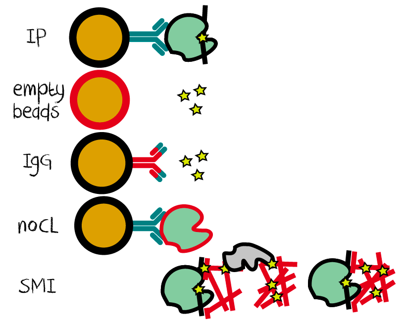

```{r setup, echo=FALSE, results="hide"}
knitr::opts_chunk$set(tidy    = FALSE,
                      cache   = FALSE,
                      dev     = "png",
                      message = FALSE,
                      error   = FALSE,
                      warning = TRUE)
suppressPackageStartupMessages(require(BiocStyle))
```	

# Preface 

```{r citaction, eval = FALSE, echo = FALSE}
#**Note:** if you use DEWSeq in published research, please cite:
#
#> Authors. (Year)
#> Title
#> *Genome Biology*, **15**:550.
#> [10.1186/s13059-014-0550-8](http://dx.doi.org/10.1186/s13059-014-0550-8)
```

## Related packages 

Other Bioconductor package with similar aim:

* `r Biocpkg("csaw")`

Please get familiar with this Bioconductor package before you are using DEWSeq

* `r Biocpkg("DESeq2")`
* `r Biocpkg("IHW")`

## Acknowledgements

Wolfgang Huber and Matthias Hentze for mentoring, advice and discussion. 
Benjamin Lang and Gian Tartaglia for great help with functional analysis
and benchmarking, as well as feedback on the vignette. Ina Huppertz for 
helpful feedback and language improvement on the vignette. Mike Love, 
Simon Anders, Bernd Klaus and Frederick Ziebell for comments and discussion.

# Introduction 

## Introduction to eCLIP sequencing 

RNA-binding proteins (RBPs) play a key role in the life-time 
of RNAs. They are involved in RNA synthesis, stability, 
degradation, transport and translation and add an 
important layer of regulation in the cell. Over 1,900 murine 
and over 1,400 human RBPs were detected in different high-throughput 
detection studies, many of them without known RNA-binding
function [@Hentze2018].

It is of great interest to detect an RBP's binding sites to 
study the underlying mechanism of its regulatory potential. Individual 
nucleotide resolution crosslinking and immunoprecipitation (iCLIP) 
[@Konig2010] and 
the further enhanced CLIP (eCLIP) protocol [@VanNostrand2016]
rely on UV crosslinking inducing covalent
bonds of RNA and proteins in close proximity. When reverse
transcribing the RNA fragment bound to the protein, a majority
of the time the reverse transcriptase will terminate at the
crosslink site. Although
eCLIP introduces updates in chemistry, the use of a size-matched 
input (SMI) control sample is an essential addition to the protocol
which can be also adapted to iCLIP or similar protocols.

```{r, fig.cap = "Crosslink site trunction at reverse transcription", out.width="80%", echo = FALSE}

```


In iCLIP and eCLIP, truncation events are extracted as one nucleotide position
next to the cDNA fragment (aligned read). In the classical protocols real 
truncations cannot be distinguished from read-through reads or other 
reads coming from otherwise truncated reads, which might be caused by
RNA modifications or the crosslinking sites of other proteins.
This might be different for each individual proteins (and the
remaining polypeptide of the digested protein). Other protocols like HITS-CLIP
and PAR-CLIP [@Hafner2010] rely exclusively on read-through events 
(although using other reverse transcriptases). While hybrid approaches exist, 
the technical difficulty of these protocols requires many optimizations steps,
which makes them rather hard to combine.

```{r, fig.cap = "Truncation sites (referred to as crosslink sites) are the neighboring position of the aligned read", out.width="80%", echo = FALSE} 
# fig.width=200, out.width="200px"
knitr::include_graphics("truncationsite.png")
```

In summary, iCLIP and eCLIP protocols provide count data for single-nucleotide
positions which might be the result of many heuristic events. These are described 
in the next chapter.


## The idea behind DEWSeq 

### Understanding the signal

#### Binding modes

Unlike transcription factors, RNA-binding proteins have many different binding
modes [@Hentze2018], some bind in a sequence specific manner, some have preference for 
structures (like stem-loops), some prefer to bind RNA modifications,
others are mostly found at UTRs. A large portion of RBPs do not have
a known RNA-binding domain and bind using disordered regions with unknown 
target preferences. 

```{r, fig.cap = "Different binding modes of RNA-binding proteins", out.width="120%", echo = FALSE} 
# fig.width=200, out.width="200px"

```
All these different binding modes can result in different crosslinking patterns,
hence different truncation event patterns.

#### Chance of crosslinking

UV crosslinking at 254 nm is used to induce covalent chemical
bonds within very close proximity of RNAs to proteins. This provides a "snapshot"
of the RNA binding event and ensures that no disassociation of the RNA-protein complexes
takes place in further steps.  Typically, crosslinking with Stratlinker(R) UV crosslinkers has
a limited efficiency of around 1% or less (depending on UV lamp intensity and time of 
irradiation). Newer crosslinkers with lasers reach up to 5-20% crosslinking
efficiency depending on the protein and experimental setup. 

```{r, fig.cap = "Chance of crosslinking", out.width="80%", echo = FALSE} 
# fig.width=200, out.width="200px"
knitr::include_graphics("crosslinking_chance.png")
```

Depending on the type of protein and the binding mode, this can result in 
different crosslinking patterns for each protein. While crosslinking affects
all RBPs, the immunoprecipitation (IP) step should only enrich for RNA fragments
bound to the RBP of interest. In turn, this means that crosslinked samples show a 
certain background which is different to normal expression patterns measured 
by RNA-sequencing.

#### Background and antibodies

##### Enrichment of targets

Immunoprecipitating your (crosslinked) protein and performing sequencing 
without any RNA digestion is called RIP-seq (without crosslinking) or 
HITS-CLIP (with crosslinking). These studies nicely show that the
enrichment of your protein with antibodies, recognizing protein tags or
native epitops will enrich RNA fragments bound to the protein.
However, the immunoprecipitated ('IP'ed) samples closely resemble a full transcriptomic 
background. Depending on the specificity of your antibody,  purification method 
(e.g. type of beads) and many other factors, this degree of resemblance can vary 
for different proteins. The authors do not know any cases where IP steps exclusively purify 
targets. If you find any such cases, please contact the authors, for further discussions
(we would really like to know).

##### Contaminants vs background  

If you take a closer look at the first iCLIP analysis protocols 
(and lot of protocols to date), you will notice that snoRNAs, lincRNAs
and other short RNAs are excluded from the analysis, although they 
make up a majority of the signal. They were either treated as contaminants
and dismissed right away, or more recently it was recommended to compare the 
i/eCLIP data with an orthogonal dataset like an RNA-seq knockout data and only look at the
regions of interest that are common in both. As already mentioned, it was shown that size-matched
input (SMI) controls can control for different artifacts coming from crosslinking 
and library preparation [@VanNostrand2016]. After applying an enrichment correction it is 
possible to detect lincRNA, snoRNA binders. 

As we previously discussed, crosslinked samples do have a different background 
compared to expressionlevels (as detected with RNA-seq). Therefore, it is of great 
importance to compare the IPed sample to a proper input control.  
*SMI controls can be easily applied to any CLIP protocols*.  

#### RNA fragment length and RNase concentrations

To narrow down the target RNAs to the binding site region, RNase is used
to digest RNA not protected by your protein. Using different RNase
concentrations will result in different RNA fragment lengths.
In addition, it was shown that the crosslinking pattern will be affected by 
longer RNA fragments, which occurs as a result of the protein of interest binding
closely together, protecting a larger RNA region from digestion [@Haberman2017]. 

```{r, fig.cap = "Different RNase concentrations will result in different fragment sizes.", out.width="80%", echo = FALSE} 
knitr::include_graphics("digestionpatterns.png")
```

#### Read-throughs

iCLIP and eCLIP depend on the termination of the reverse transcriptase
at crosslink sites. In contrast, HITS-CLIP and PAR-CLIP need reverse
transcriptases reading through the crosslink sites. 
Both methods use different reverse transcriptases with 
different likelihood of truncating or reading through [@Hocq2018]. 
The chance of this event will also be affected by the
polypeptide which is left after protein digestion of the protein of interest.

```{r, fig.cap = "Read-throughs", out.width="80%", echo = FALSE} 
knitr::include_graphics("readthrough.png")
```

"Read-through" events can truncate at crosslink sites from the same protein,
a different protein, an RNA modification, any other unknown events or
finish at the end of an RNA fragment. Due to the low efficiency 
the crosslinking of multiple proteins is usually less likely, however 
not improbable.

##### Early truncations 

Early truncations can also occur on a long RNA fragment with multiple 
crosslink sites from different proteins or multiple crosslink sites 
from the same protein. Again, although low crosslinking
efficiency reduces the chance of having multiple crosslink sites
at once, those events occur stochastically. 

```{r, fig.cap = "Early truncation events", out.width="100%", echo = FALSE} 
knitr::include_graphics("earlytruncation.png")
```


### Method

#### Differentially expressed sliding windows 

Because of the properties of i/eCLIP data described above, we use a 
sliding window approach (where different window and step sizes can be chosen in 
the preprocessing step) and test for significant enrichment in the IP over the
control. For this, we extended `r Biocpkg("DESeq2")` for a one-sided 
test: first, we filter windows with negative wald test statistic values (windows with negative log2FoldChange) 
followed a right-tailed test on the remaining windows. The advantage is that the filtering step increases performance 
when testing millions of windows. 

```{r , fig.cap = "Sliding window approach with single-nucleotide position count data", out.width="120%", echo = FALSE} 
knitr::include_graphics("dewseqoverview.png")
```

#### Combining significant windows

In contrast to large fragments detected in ChIP-seq, the truncation sites 
are only one nucleotide. To combine windows in ChIP-seq dataset, `r Biocpkg("csaw")` 
defines binding regions which are then subjected to multiple
hypothesis correction. In ChIP-seq many windows share coverage from large
cDNA fragments and therefore `r Biocpkg("csaw")` performs multiple hypothesis
correction on binding site with the SIMES method [@SIMES1986]. SIMES joins coverage blocks
and treats them as one entity for multiple hypothesis correction. In large,
SIMES punished p-values for long stretches of overlapping windows. Please
refer to the `r Biocpkg("csawUserGuide")` for detailed description. 


Single-nucleotide truncation events do not have the same property as cDNA
fragments and the transcriptomic background for each gene in eCLIP or iCLIP
often results in large coverage blocks. As seen in the picture below, the
windows do only share information with the overlapping windows. Therefore, 
DEWSeq corrects the p-value for each
overlapping window with the number of overlaps using Bonferroni correction. 

```{r, fig.cap = "Combining significant windows", echo = FALSE, out.width="80%"} 
# fig.width=200, out.width="200px"
knitr::include_graphics("overlapping_sliding_windows.png")
```

We then apply FDR correction on the p-values corrected for overlaps using Bonferroni correction.

## Prerequisits for DEWSeq

Most importantly, replicates and input controls are required for the 
significance testing for DEWSeq. Currently, we only allow the use of 
`r Biocpkg("DESeq2")`'s wald test and LRT test. Please contact the authors if you would like
to use more complex models in your analysis.

### Input controls

Typically, CLIP-seq sa mples show a background which comes from
a mix of various transcripts with different expression levels.
Additionally, UV crosslinking does not affect RNAs in a linear fashion, 
therefore an appropriate input control is needed for the analysis of
eCLIP/iCLIP data. Unfortunately, total RNA-seq does not reflect the 
UV crosslinked background. Also neither IgG-, empty beads, 
nor similar controls seem to be appropriate input controls. Mostly, 
IgG and empty bead controls suggest that the IP input is very clean, 
which is not what is seen in the data. IP sample often have a 
broad background signal and bias towards sno and lincRNAs, as well
as other RNA types. Often, a majority of the reads in the IP come
from such background, although the IgG and empty bead control samples
cannot correct for that.


We recommend size-matched input controls (SMI) controls as performed in
the eCLIP protocol [@VanNostrand2016]. 
This type of input control is not protocol specific, therefore can be 
easily adapted to iCLIP or other CLIP studies. It proves useful to 
exclude many false positives and can
control for truncations caused by interferences.


```{r, fig.cap = "Combining significant windows", out.width="80%", echo = FALSE} 

```

*Empty beads* controls are usually crosslinked and control for unspecific
background caused through beads, *IgG* controls are usually crosslinked
and control additionally for background caused by the invariable region
of the antibody. *No crosslink* (noCL) controls for background 
caused by the protein and the functional antibody. *SMI* controls are 
crosslinked but not enriched, it controls among others for the 
background caused by crosslinked RNA. 


`r Biocpkg("DEWSeq")` uses SMI controls to calculate enrichment in the
IPed samples. We recommend to use IgG or empty beads controls to flag 
(expression dependent) regions for optional removal. 

### Replicates

Biological replicates in high-throughput studies are needed in the 
significance testing process to ensure reproducibility of the results.
Please refer to the `r Biocpkg("csaw")` package for discussion on this topic.

In general, we recommend to ask yourself how many replicates would you
use when performing RNA-seq. Usually, the answer is, at least three
for the sample and three for the control (depending on many experimental
factors which also will apply for your CLIP study). As a rule of thumb, 
your number of replicates should not be less if you are 
interested in an transcriptome wide analysis of your RNA-binding protein.

# Data pre-processing

DEWSeq needs a countmatrix and preprocessed annotation. The
preprocessing is done in two general steps.

1. Raw data preprocessing, alignment and PCR duplication removal
2. Extraction of crosslink sites, preprocessing of annotation and counting.

## Raw data pre-processing

**From fastq to bam files**

eCLIP or iCLIP data preprocessing can be time-consuming. 
Generally, the pre-processing steps are:

* Unique Molecular Identifiers (UMIs) extraction and demultiplexing
  ([Je Suite](https://gbcs.embl.de/portal/tiki-index.php?page=Je), or other
  tools). Usually, the UMI is extracted from the fasta sequence and added to
  the header. Different tools add the UMI at different locations (beginning or
  end of fastq header).
* Read quality filtering (optional)
* Trimming of sequencing adapters (with tools like
  [cutadapt](https://cutadapt.readthedocs.io))
* Second trimming step (**extremely important** for standard paired-end eCLIP
  libraries). This is needed because a 'bug' in the standard paired-end eCLIP
  protocol.  
  _Hint_: Single-read seCLIP [@VanNostrand2017] has a lot of advantages 
  to standard, paired-end eCLIP, one of them is that you can skip this preprocessing step
* Quality Control ([fastqc](https://github.com/s-andrews/FastQC) with
  [multiqc](https://multiqc.info/) summary statistics or similar).
* Alignment ([Novoalign](http://www.novocraft.com/products/novoalign/), 
  [STAR](https://github.com/alexdobin/STAR), or other (splice-aware) aligners, 
  depending on your organism).
* PCR duplication removal also called UMI evaluation
  [Je Suite](https://gbcs.embl.de/portal/tiki-index.php?page=Je) or 
  custom tools depending on your protocol and single-read or paired-end setup.
  Please use tools which consider sequencing errors in the UMI and read 
  sequences.
* Sort and index bam files ([samtools](http://samtools.sourceforge.net) or
  similar)

Eventually, you will end up with sorted *.bam* files.

## Crosslink site extraction and counting

**From bam and gff3 files to count matrix and annotation**

[htseq-clip](https://pypi.org/project/htseq-clip/) is the 
preprocessing pipeline developed for the use for
DEWSeq, but other tools may be used. 
htseq-clip performs the following steps:

* extract sites (typically crosslink sites) 
* flatten the annotation and create a mapping file for later use
* generate sliding windows from the flattened annotation 
* count sites in sliding windows
* create count matrices 

```{r, fig.cap = "htseq-clip workflow", out.width="100%", echo = FALSE}

```

In addition, htseq-clip can also: 

* split the annotation into UTRs, CDS
* count non-overlapping regions (UTRs, CDS, exons, introns, etc) for 
   enrichment plots or DESeq2 analysis

htseq-clip can be installed via Python package installer as:

```{bash, eval = FALSE}
pip install htseq-clip
```

Additional details on htseq-clip functions and required input files are [described here](https://htseq-clip.readthedocs.io/en/latest/)

All you need is

 * .bam files (PCR duplication removed, sorted)
 * .bam.bai index files 
 * .gff3 files (Preferrably from Gencode or similar)

An earlier, Python 2.7 compatibile version of htseq-clip is provided as a [singularity container](https://sylabs.io/) image and comes 
with a [Snakemake](https://snakemake.readthedocs.io/en/stable/) workflow for processing on local computers,
servers, or computer clusters.

Tip: You can use Sailfish, Kallisto, RSEM, Salmon or any (pseudo)aligner to 
get an estimation of the different expression levels of transcripts. Use this to 
filter the annotation before flattening it. 


# Detection of enriched regions with DEWSeq
 
DEWSeq uses a sliding window approach with DESeq2 for enriched binding sites. 

## Installation

DEWSeq can be installed from Bioconductor as follows:

```{r install, eval = FALSE}
if(!requireNamespace("BiocManager", quietly = TRUE))
    install.packages("BiocManager")
BiocManager::install("DEWSeq")
```


## Load the library

First step is to load the required libraries with this command

```{r load library, eval = TRUE}
require(DEWSeq)
require(IHW)
require(tidyverse)
```

## Importing data for DEWSeq


This example uses ENCODE SLBP data set, contains two IP and one input control (SMI) samples which
is not ideal, however it is small enough as test data. 

```{r filenames, eval = TRUE}
countFile <- file.path(system.file('extdata',package='DEWSeq'),'SLBP_K562_w50s20_counts.txt.gz')
annotationFile <- file.path(system.file('extdata',package='DEWSeq'),'SLBP_K562_w50s20_annotation.txt.gz')
```

### Read data

We need to read in the 

* count matrix and the (UNIQUE_ID, counts per sample)
* annotation file (UNIQUE_ID, chromosome locations, other info)

which can be prepared with htseq-clip (see above)

For this, we recommend `data.table` or `tidyr` packages to read in the data swiftly.
In our experience, data.table is significantly faster than tidyr.

```{r loading tidyverse, eval = TRUE, results='hide'}
library(tidyverse)
library(data.table)
```

First we read in counts 

```{r read in count matrix, eval = TRUE}
countData <- fread(countFile, sep = "\t")
```

or alternatively with tidyr (slower):

```{r read count matrix tidyr, eval = TRUE}
countData <- read_tsv(countFile)
```

Then we read in the annotation data frame 

```{r read in annotation, eval = TRUE}
annotationData <- fread(annotationFile, sep = "\t")
```
or alternatively with tidyr (slower):

```{r read annotation tidyr, eval = FALSE}
annotationData <- read_tsv(annotationFile)
```

Let's take a look at the data files

```{r datasummary}
head(countData)
dim(countData)
head(annotationData)
dim(annotationData)
```


Finally we have to create a sample description
```{r create colData}
colData <- data.frame(
  row.names = colnames(countData)[-1], # since the first column is unique_id
  type      = factor(
                c(rep("IP", 2),    ##  change this accordingly
                  rep("SMI", 1)),  ##
                levels = c("IP", "SMI"))
)
```

This function will parse the annotation file and create a DESeq object

```{r example import}
ddw <- DESeqDataSetFromSlidingWindows(countData  = countData,
                                      colData    = colData,
                                      annotObj   = annotationData,
                                      tidy       = TRUE,
                                      design     = ~type)
ddw
```

This will return a DESeq object with the coordinates and annotation stores as 
rowAnnotation.

## Prefiltering

Prefiltering becomes even more important with large numbers of sliding windows. 
Please find more details here:
[DESeq2 vignette on pre-filtering](http://bioconductor.org/packages/devel/bioc/vignettes/DESeq2/inst/doc/DESeq2.html#pre-filtering)

```{r row filtering, eval = TRUE}
keep <- rowSums(counts(ddw)) >= 10
ddw <- ddw[keep,]
```

## Estimating Size Factors

For library normalisation, rather than modifying the raw counts,
DESeq2 estimates size factors which are incorportated in the anlaysis.
For more information, please refer to the DESeq2 vignette.

The standard procedure to estimate size factors is 

```{r estimate size factors, eval = TRUE}
ddw <- estimateSizeFactors(ddw)
sizeFactors(ddw)
```

### Estimate size factors based on a specific set of RNAs

CLIP data often shows high expression levels of small RNAs like snoRNAs,
lincRNAs etc, therefore you might want to normalise based on protein coding
genes only.

```{r filter for mRNAs, eval = TRUE}
ddw_mRNAs <- ddw[ rowData(ddw)[,"gene_type"] == "protein_coding", ]
ddw_mRNAs <- estimateSizeFactors(ddw_mRNAs)
sizeFactors(ddw) <- sizeFactors(ddw_mRNAs)
sizeFactors(ddw)
```

### Estimate size factor for assymetric data

In general, when there is asymmetry in the data,
like enrichment in IP over control,
it is a good pratice to call differentially
expressed features with DESeq2 and then exclude them for 
normalisation. This might be adjusted for your proteins.

First we identify significant windows in IP or the controls.

```{r tmp significant windows}
ddw_tmp <- ddw
ddw_tmp <- estimateDispersions(ddw_tmp, fitType = "local", quiet = TRUE)
ddw_tmp <- nbinomWaldTest(ddw_tmp)

tmp_significant_windows <- 
                results(ddw_tmp,
                    contrast = c("type", "IP", "SMI"),
                    tidy = TRUE,
                    filterFun = ihw) %>% 
                dplyr::filter(padj < 0.05) %>% 
                .[["row"]]
rm("ddw_tmp")
```

Then we exclude those for the estimation of the size factors
```{r}
ddw_mRNAs <- ddw_mRNAs[ !rownames(ddw_mRNAs) %in% tmp_significant_windows, ]
ddw_mRNAs <- estimateSizeFactors(ddw_mRNAs)
sizeFactors(ddw) <- sizeFactors(ddw_mRNAs)

rm( list = c("tmp_significant_windows", "ddw_mRNAs"))

sizeFactors(ddw)
```


## Differential expressed windows analysis

### Estimate dispersions and wald test

The next step is to estimate the dispersions and perform the wald test
with these two functions.

Please read up on fitType in the `r Biocpkg("DESeq2")` package and adjust
according to your data set.

```{r estimate dispersions and wald test, eval = TRUE}
ddw <- estimateDispersions(ddw, fitType = "local", quiet = TRUE)
ddw <- nbinomWaldTest(ddw)
```

You can check the dispersion estimates with the following function:

```{r, fig.cap = "Dispersion Estimates", fig.wide = TRUE}
plotDispEsts(ddw)
```

### Significance testing 

In the next step we perform a one-sided signficance test, looking for
enrichment in the IP samples vs the SMI controls. 
Also it will perform a correction
for p-values of overlapping windows: The function will determine how many 
overlapping windows for each window there are (this can vary at the end of 
features, e.g. a gene) and then perform Bonferroni for each window. 

These family-wise corrected windows will corrected for multiple testing 
with Benjamini-Hochberg.

```{r DEWSeq results, eval = TRUE}
resultWindows <- resultsDEWSeq(ddw,
                              contrast = c("type", "IP", "SMI"),
                              tidy = TRUE) %>% as_tibble

resultWindows
```

You might be interested to correct for multiple hypothesis testing with IHW.

```{r IHW multiple hypothesis correction, eval = TRUE, warning = FALSE}
resultWindows[,"p_adj_IHW"] <- adj_pvalues(ihw(pSlidingWindows ~ baseMean, 
                     data = resultWindows,
                     alpha = 0.05,
                     nfolds = 10))
```


Here some basic stats about the differentially expressed windows:

```{r windows tables, eval = TRUE}
resultWindows <- resultWindows %>% 
                      mutate(significant = resultWindows$p_adj_IHW < 0.01)

sum(resultWindows$significant)
```

`r sum(resultWindows$significant)` windows are significant. 

Here are the top 20 from 
`r resultWindows %>% filter(significant) %>% .[["gene_name"]] %>% unique %>% length` 
genes:

```{r how genes form windows}
resultWindows %>%
   filter(significant) %>% 
   arrange(desc(log2FoldChange)) %>% 
   .[["gene_name"]] %>% 
   unique %>% 
   head(20)
```

SLBP is an histone-RNA binding protein, so we are quite happy to see that the
majority of the hits are coming from histone genes. 

## Combining regions

`resultWindows` contains information about the differential expression of
windows. Now we would like to combine overlapping windows to a binding region.

```{r extractRegions, eval = TRUE, results = "hide"}
resultRegions <- extractRegions(windowRes  = resultWindows,
                                padjCol    = "p_adj_IHW",
                                padjThresh = 0.01, 
                                log2FoldChangeThresh = 0.5) %>% as_tibble
```

Since we already corrected for the family wise error, we use the
`extractRegions` function to combine the overlapping significant windows and
provide metrics for best and worst p-adjusted value, as well as best and 
worst log2 fold change.

```{r resultRegions output, eval = TRUE}
resultRegions
```

`r nrow(resultRegions)` binding regions were found which can exported as
BED file so you can browse the regions in your genome browser of choice
or use it for further analyses.

```{r toBED output, eval = FALSE}
toBED(windowRes = resultWindows,
      regionRes = resultRegions,
      fileName  = "enrichedWindowsRegions.bed")
```

Further analyses which can be done is enrichment of gene types, sequence
motif analysis of the regions, secondary structure analysis of binding 
regions and other functional analyses. 

# Discussion

The authors very much welcome any feedback, comments and suggestions.

# Session Info

```{r}
sessionInfo()
```

# References


